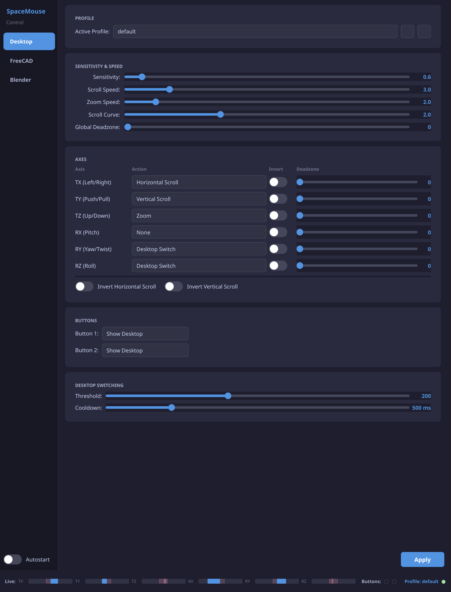
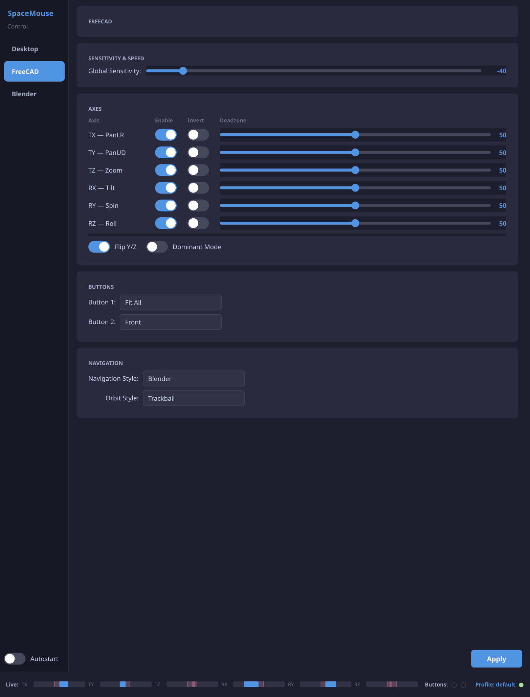
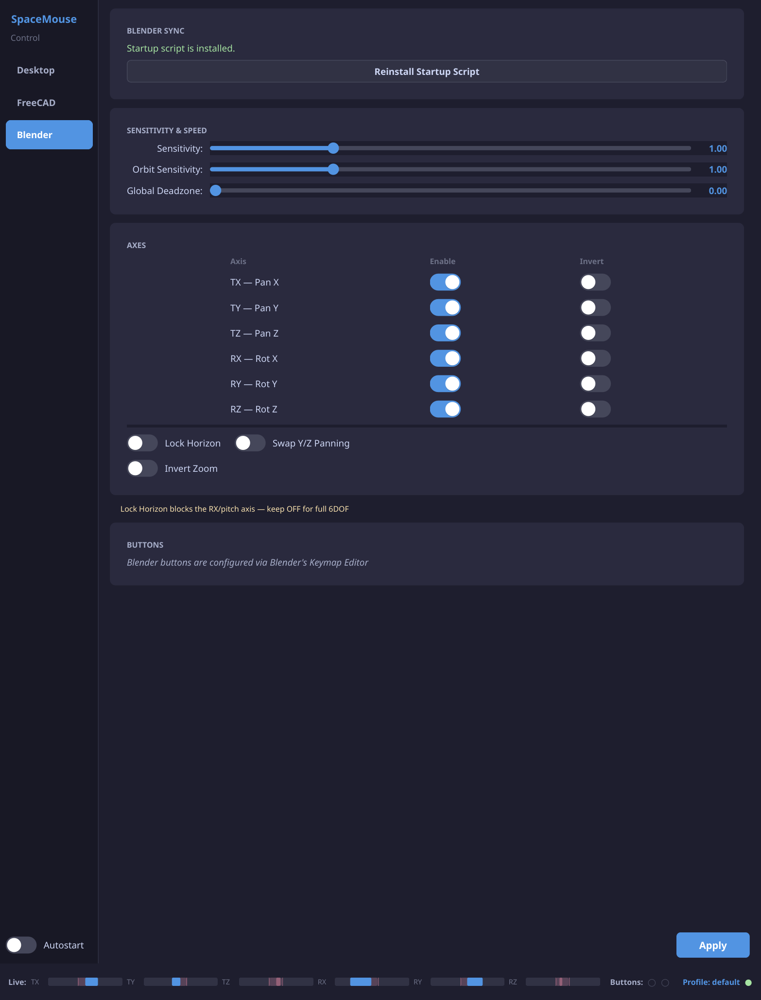

# SpaceMouse Linux Driver

> **This project is under active development.** Contributions and feedback are welcome — feel free to open an issue or pull request.

Use your 3Dconnexion SpaceMouse as a desktop input device on Linux.
Tilt to scroll, push/pull to zoom, twist to switch virtual desktops — and it works natively inside Blender and FreeCAD for 3D navigation.

## What You Need

- **Arch Linux** (or Arch-based like EndeavourOS, Manjaro)
- **3Dconnexion SpaceMouse** connected via USB
- **yay** or **paru** (AUR helper) — if you don't have one, [install yay](https://github.com/Jguer/yay#installation)

## Installation

```bash
git clone https://github.com/Maik-0000FF/SpaceMouse_3dconnexion.git
cd SpaceMouse_3dconnexion
./install.sh
```

The installer takes care of everything: installing packages, setting up permissions, compiling the driver, and starting the background services. You'll be asked for your password when it needs administrator access.

After installation, **plug in your SpaceMouse** (or unplug and replug it) and it's ready to use.

## How It Works

Once installed, the SpaceMouse works on your desktop like this:

- **Tilt left/right** → horizontal scroll
- **Tilt forward/back** → vertical scroll
- **Push down / pull up** → zoom (Ctrl+scroll)
- **Twist left/right** → switch virtual desktops
- **Left button** → KDE Overview
- **Right button** → Show Desktop

When you switch to **Blender** or **FreeCAD**, the desktop driver steps aside automatically and the app's native 3D navigation takes over — no manual switching needed.

A **system tray icon** appears in your taskbar. Click it to open **SpaceMouse Control** — a settings app with three pages:

- **Desktop** — sensitivity, axis mapping, deadzone, button actions
- **FreeCAD** — SpaceMouse sensitivity, axis enable/invert, per-axis deadzone, navigation style
- **Blender** — NDOF sensitivity, deadzone, axis inversion, Lock Horizon toggle

| Desktop | FreeCAD | Blender |
|---------|---------|---------|
|  |  |  |

A live preview bar at the bottom shows real-time axis movement and button state. While the settings window is focused, desktop actions are automatically disabled so the SpaceMouse doesn't interfere while you configure it.

FreeCAD and Blender connect directly to spacenavd — they don't need the GUI or daemon running. You can close SpaceMouse Control completely and 3D navigation keeps working. Settings are written to each app's config file and persist across restarts.

## Blender

Blender works out of the box — no extra setup needed.

To configure Blender's SpaceMouse settings from the GUI:

1. Open **SpaceMouse Control** (tray icon) → **Blender** page
2. Adjust sensitivity, deadzone, axis inversion, etc.
3. Click **Apply**
4. Click **Install Startup Script** (first time only)
5. Restart Blender — settings are applied automatically on every launch

> **Tip:** If pitch/tilt doesn't work in Blender, make sure **Lock Horizon** is OFF (Blender enables it by default, which blocks the pitch axis).

## FreeCAD

FreeCAD on Linux has several SpaceMouse issues. We've contributed fixes upstream — some are already merged, others are in progress. Until all fixes reach stable releases, you can build a fully patched version yourself.

> **Availability:** PR #28110 is merged into FreeCAD `main` and will be available in **weekly builds after 2026-03-07** and in **FreeCAD 1.2**. It is **not** included in FreeCAD 1.0.x or 1.1.x releases. PR #28181 is targeted for FreeCAD 1.2.

### FreeCAD SpaceMouse Patches

| Fix | Issue | Status | Description |
|-----|-------|--------|-------------|
| Event coalescing | [PR #28110](https://github.com/FreeCAD/FreeCAD/pull/28110) | **Merged** | Fixes jerky navigation (250Hz → 60fps) |
| Batched camera updates | [PR #28110](https://github.com/FreeCAD/FreeCAD/pull/28110) | **Merged** | Prevents double redraws per frame |
| Per-axis deadzone | [PR #28110](https://github.com/FreeCAD/FreeCAD/pull/28110) | **Merged** | Configurable deadzone per axis via `user.cfg` |
| Button selection sync | [PR #28181](https://github.com/FreeCAD/FreeCAD/pull/28181) | In merge queue | Fixes wrong button assignment in preferences |
| Checkable action invoke | [PR #28181](https://github.com/FreeCAD/FreeCAD/pull/28181) | In merge queue | Fixes camera toggle buttons not working |
| Disconnect detection | [#17809](https://github.com/FreeCAD/FreeCAD/issues/17809) | PR planned | Fixes 100% CPU when spacenavd stops |

A single **pattern-based Python patcher** (`freecad-patches/apply-spacemouse-fix.py`) applies all six fixes to any FreeCAD version. It finds code by pattern matching — no line numbers, no version-specific patches. Already-merged fixes are automatically skipped.

**Target versions:** FreeCAD **1.0.x** and **1.1.x** (including RC builds). These versions do not include any of the above fixes. Starting with FreeCAD **1.2**, the merged fixes will be included natively and the patcher will skip them automatically.

```bash
# Check what can be patched (dry-run)
python3 freecad-patches/apply-spacemouse-fix.py --check /path/to/freecad-source

# Apply all fixes
python3 freecad-patches/apply-spacemouse-fix.py /path/to/freecad-source
```

> For technical details, see [docs/FREECAD_SPACEMOUSE_FIX.md](docs/FREECAD_SPACEMOUSE_FIX.md).

### Build patched FreeCAD (Arch Linux)

**Choose your version** by editing `freecad-pacman-build/PKGBUILD` — change `_build_version` at the top:

| Setting | Version | Description |
|---------|---------|-------------|
| `_build_version="stable"` | 1.0.2 | Latest stable release |
| `_build_version="rc"` | 1.1rc2 | Release candidate (newer features) |

```bash
cd freecad-pacman-build
makepkg -sfi
```

This downloads the source, applies the patcher, compiles, and installs as a normal Arch package. Takes **15–45 minutes** depending on your CPU.

> After a system update (`pacman -Syu`), FreeCAD gets replaced with the stock version. Just run `cd freecad-pacman-build && makepkg -sfi` again.

### Configure the SpaceMouse

1. Start FreeCAD once and close it (creates config files)
2. Run the setup script: `./scripts/freecad-spacemouse-patch.sh`
3. Or use **SpaceMouse Control** → **FreeCAD** page to adjust settings

> **Important:** Always close FreeCAD before editing settings. FreeCAD overwrites its config on exit.

## Uninstall

```bash
./uninstall.sh
```

## Troubleshooting

### SpaceMouse not detected

1. Check that the device is plugged in: `lsusb | grep -i 3dconnexion`
2. Check that the system daemon is running: `systemctl status spacenavd`
3. Run the built-in diagnostic: `spacemouse-test --check`

If spacenavd isn't running:

```bash
sudo systemctl enable --now spacenavd
```

### FreeCAD SpaceMouse is jerky/stuttering

You're running an unpatched FreeCAD. The fix ([PR #28110](https://github.com/FreeCAD/FreeCAD/pull/28110)) is merged but may not be in your installed version yet. Rebuild with the patcher:

```bash
cd freecad-pacman-build && makepkg -sfi
```

### FreeCAD 100% CPU after spacenavd stops

Known bug ([#17809](https://github.com/FreeCAD/FreeCAD/issues/17809)). When spacenavd crashes or stops, FreeCAD's QSocketNotifier loops on the dead socket. Build a patched version with the patcher to fix this, or restart FreeCAD after restarting spacenavd.

### Tray icon not showing

```bash
systemctl --user restart spacemouse-config
```

### Buttons don't respond

Open the tray icon settings and check that button actions are set (default: Left = Overview, Right = Show Desktop).

## Advanced

### Diagnostics

```bash
spacemouse-test --check   # System checks (USB, spacenavd, uinput)
spacemouse-test --live    # Real-time axis and button monitor
spacemouse-test --led     # LED toggle test
```

### Supported devices

| Device | Status |
|--------|--------|
| SpaceNavigator (046d:c626) | Tested (fully working, including LED control) |
| SpaceMouse Compact | Should work (untested) |
| SpaceMouse Wireless | Should work (untested) |
| SpaceMouse Pro (Wireless) | Should work (untested) |
| SpaceMouse Enterprise | Should work (untested) |

Any 6DOF device supported by spacenavd should work. LED control currently only works for the SpaceNavigator — other models may use different HID report formats. If you have a different model, please [open an issue](https://github.com/Maik-0000FF/SpaceMouse_3dconnexion/issues).

## License

GPLv3 — See [LICENSE](LICENSE) for details.

## Status

This project is **actively maintained**. Current focus: desktop navigation and 3D app integration.

**FreeCAD upstream contributions:**
- [PR #28110](https://github.com/FreeCAD/FreeCAD/pull/28110) — Smooth navigation + per-axis deadzone (**merged**)
- [PR #28181](https://github.com/FreeCAD/FreeCAD/pull/28181) — Button fixes (in merge queue, milestone 1.2)
- [#17809](https://github.com/FreeCAD/FreeCAD/issues/17809) — 100% CPU fix (PR planned)

**Planned:**
- AUR package for the driver itself
- Multi-device support (SpaceMouse Pro buttons)

Found a bug or have a feature request? [Open an issue](https://github.com/Maik-0000FF/SpaceMouse_3dconnexion/issues).

## Acknowledgments

- [spacenavd](https://github.com/FreeSpacenav/spacenavd) — Open-source SpaceMouse device daemon
- [libspnav](https://github.com/FreeSpacenav/libspnav) — Client library for SpaceMouse input
